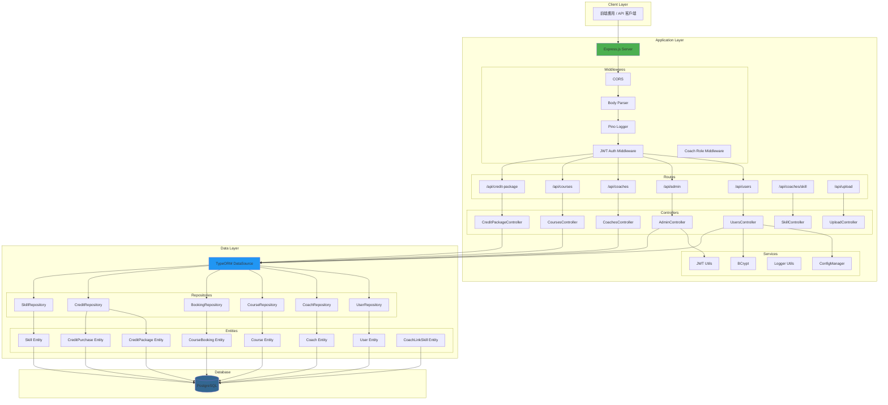
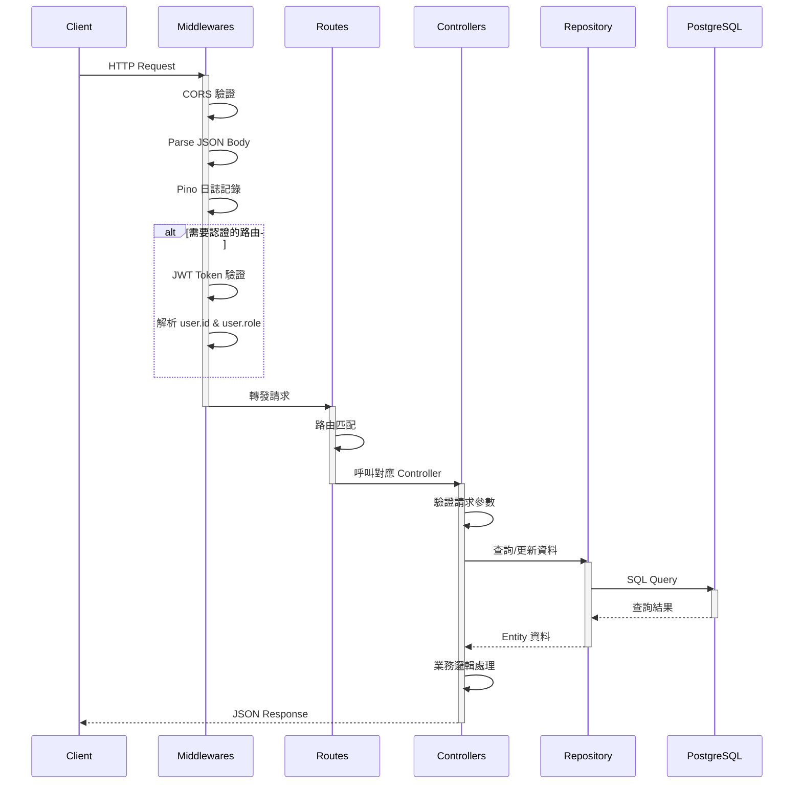
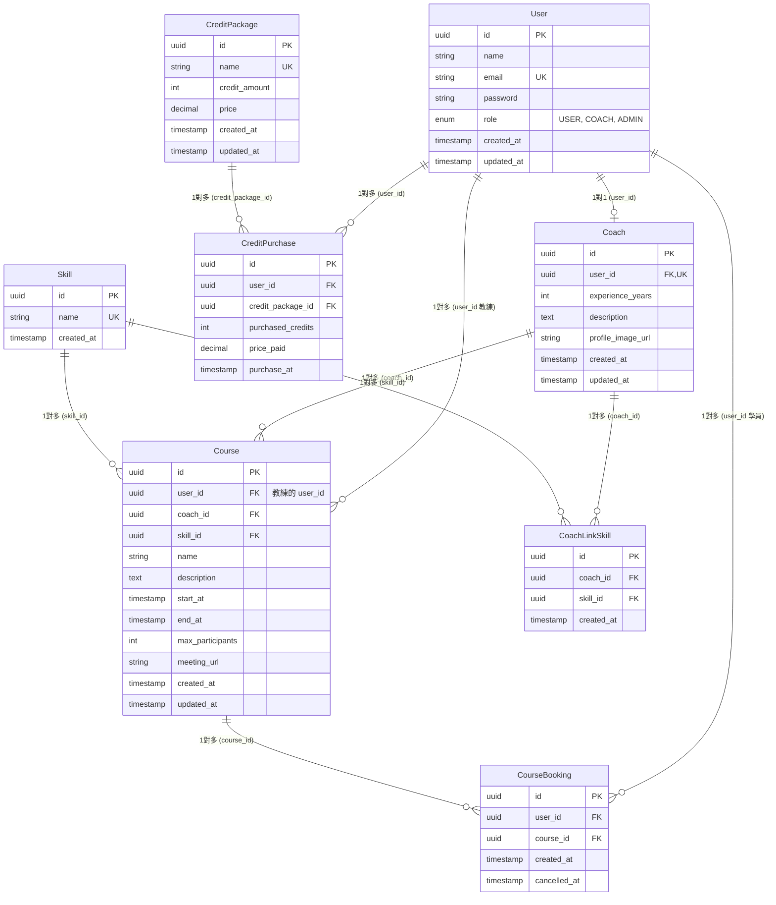
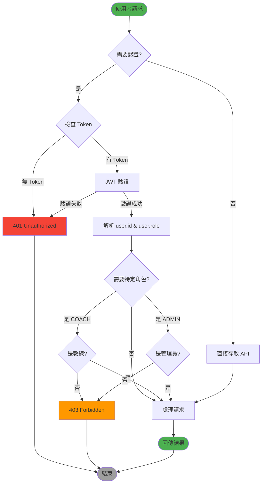
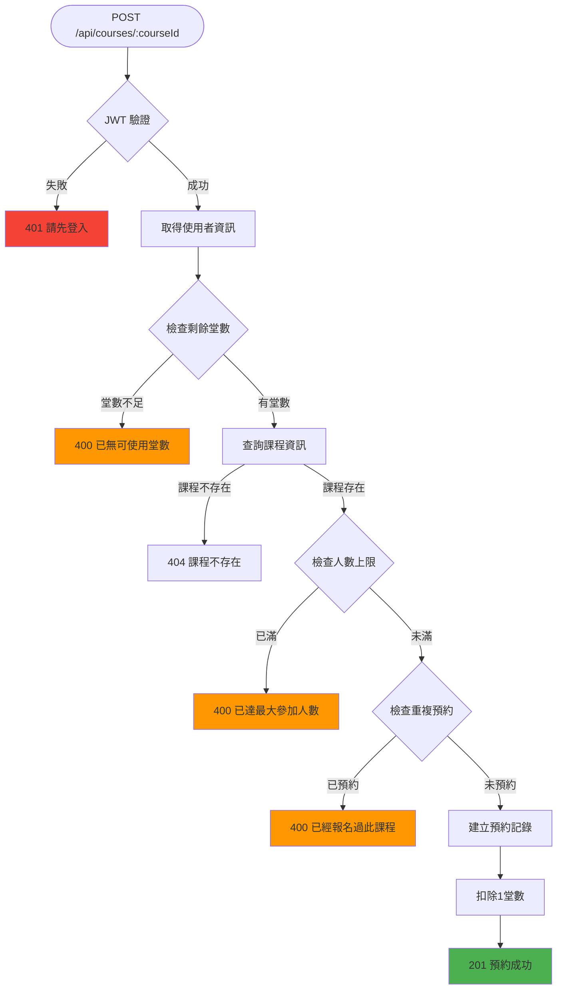
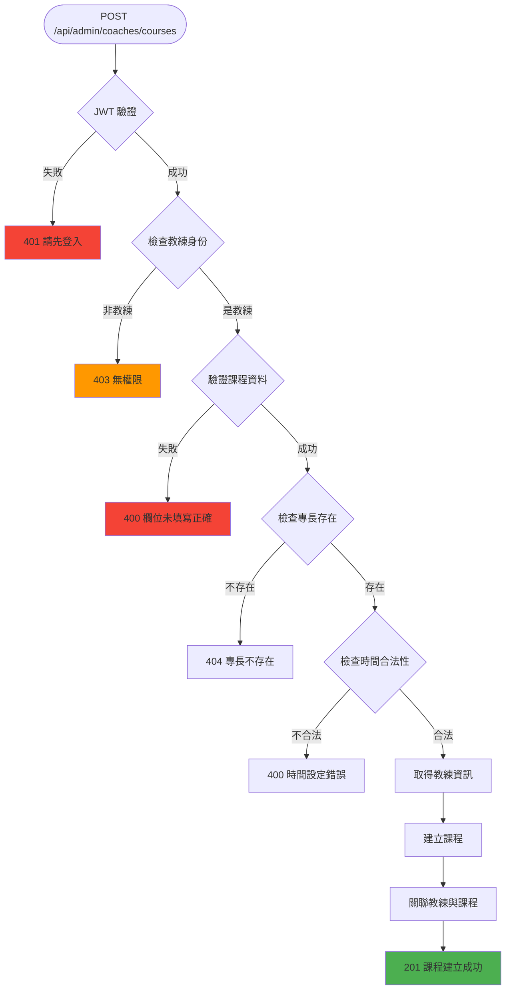
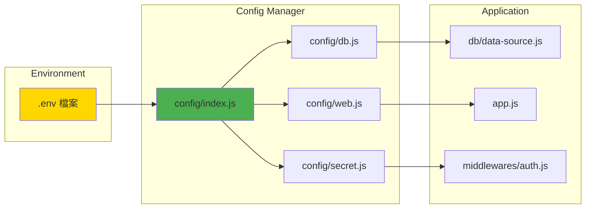
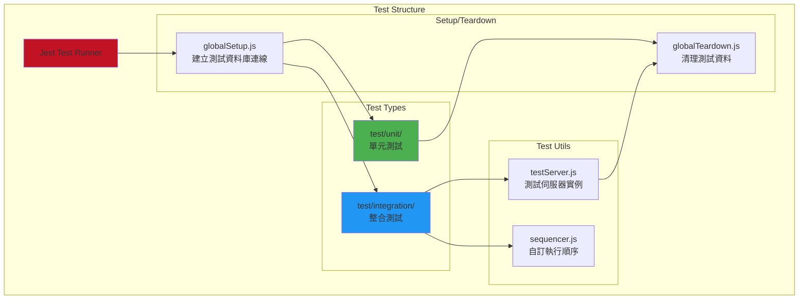
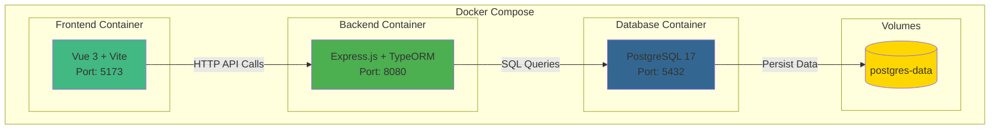

# 後端架構流程圖

本文件使用 Mermaid 圖表展示健身房管理系統後端的架構設計。

## 1. 整體分層架構

## 2. API 請求流程

## 3. 資料庫 Entity 關聯圖

## 4. 使用者認證流程

## 5. 登入與註冊流程

```mermaid
flowchart TD
    subgraph "註冊流程"
        SignupStart([POST /api/users/signup]) --> ValidateSignup{驗證輸入}
        ValidateSignup -->|失敗| SignupBadRequest[400 欄位未填寫正確]
        ValidateSignup -->|成功| CheckPassword{密碼格式?}
        CheckPassword -->|不符合| PasswordError[400 密碼規則錯誤]
        CheckPassword -->|符合| CheckEmail{Email 存在?}
        CheckEmail -->|是| EmailConflict[409 Email 已被使用]
        CheckEmail -->|否| HashPassword[BCrypt Hash 密碼]
        HashPassword --> CreateUser[建立使用者]
        CreateUser --> SignupSuccess[201 註冊成功]
    end

    subgraph "登入流程"
        LoginStart([POST /api/users/login]) --> ValidateLogin{驗證輸入}
        ValidateLogin -->|失敗| LoginBadRequest[400 欄位未填寫正確]
        ValidateLogin -->|成功| CheckPasswordFormat{密碼格式?}
        CheckPasswordFormat -->|不符合| LoginPasswordError[400 密碼規則錯誤]
        CheckPasswordFormat -->|符合| FindUser{查詢使用者}
        FindUser -->|不存在| LoginFailed[400 使用者不存在]
        FindUser -->|存在| ComparePassword{比對密碼}
        ComparePassword -->|不符合| LoginFailed
        ComparePassword -->|符合| GenerateToken[產生 JWT Token]
        GenerateToken --> LoginSuccess[201 登入成功 + Token]
    end

    style SignupSuccess fill:#4CAF50
    style LoginSuccess fill:#4CAF50
    style SignupBadRequest fill:#f44336
    style LoginBadRequest fill:#f44336
    style EmailConflict fill:#ff9800
    style LoginFailed fill:#f44336
```

## 6. 課程預約流程

## 7. 教練建立課程流程

## 8. 配置管理架構

## 9. 測試架構

## 10. Docker 容器架構

## 架構特點說明

### 1. 分層架構優勢
- **關注點分離**: Routes、Controllers、Entities 各司其職
- **易於測試**: 每層可獨立進行單元測試
- **可維護性**: 修改業務邏輯不影響路由定義

### 2. TypeORM EntitySchema 模式
- 使用 JavaScript Object 定義 Entity (非 TypeScript Decorator)
- 適合純 JavaScript 專案
- 類型定義更靈活

### 3. Middleware Factory Pattern
- Auth middleware 使用工廠模式建立
- 可注入 secret 和 repository 依賴
- 提高可測試性和靈活性

### 4. 配置管理
- 使用 ConfigManager 集中管理配置
- 透過 `ConfigManager.get('db.host')` 存取
- 支援多環境配置切換

### 5. 認證與授權
- JWT Token 認證
- Role-based access control (USER, COACH, ADMIN)
- Middleware 層級的權限檢查

### 6. 測試策略
- 單元測試: 測試獨立函式和工具
- 整合測試: 測試完整 API 流程
- Custom Sequencer: 確保測試執行順序
- Test Server: 提供隔離的測試環境

### 7. 錯誤處理
- 統一錯誤處理 middleware
- 結構化錯誤回應 (status, message)
- Pino 日誌記錄所有錯誤

### 8. 容器化部署
- Docker Compose 一鍵啟動
- 服務間依賴管理 (healthcheck)
- Volume 持久化資料
- 日誌輪轉配置
