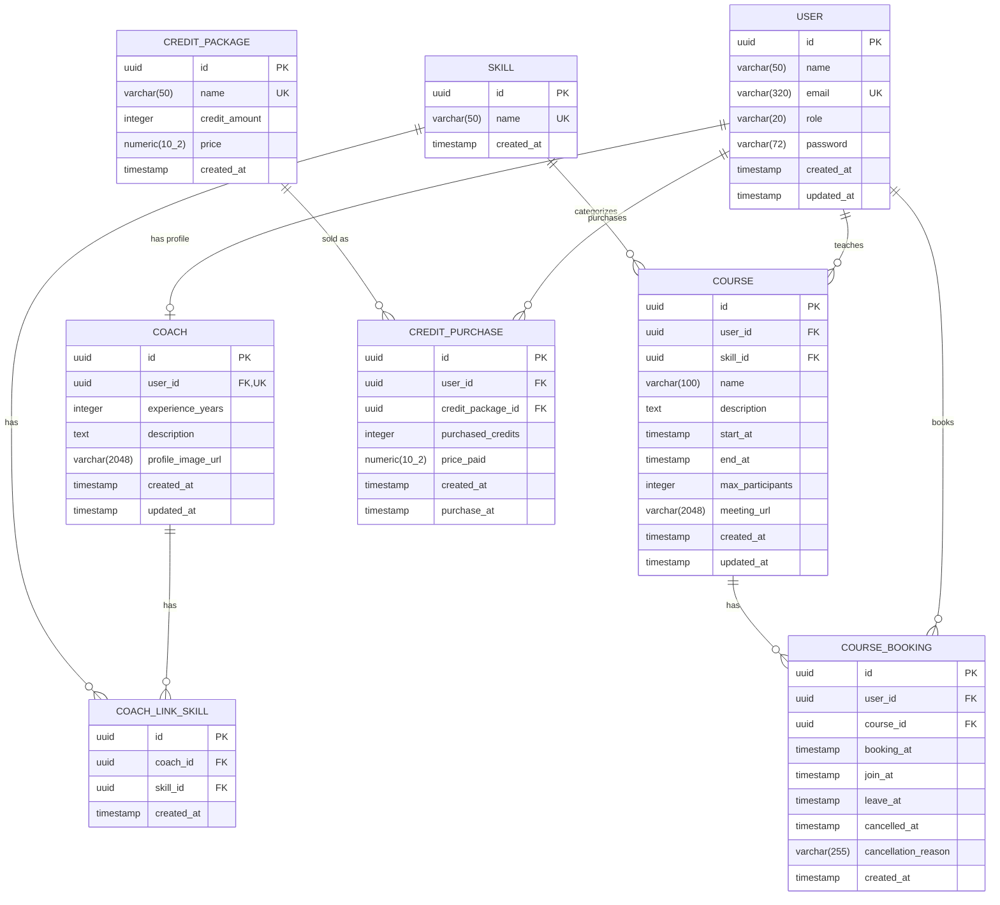

# 健身房管理系統 - 資料庫架構圖

## ER Diagram

## 資料表說明

### USER (使用者)

| 欄位 | 類型 | 約束 | 說明 |
|------|------|------|------|
| id | UUID | PK | 使用者編號 |
| name | VARCHAR(50) | NOT NULL | 姓名 |
| email | VARCHAR(320) | NOT NULL, UNIQUE | 電子郵件 |
| role | VARCHAR(20) | NOT NULL | 角色 (user/coach/admin) |
| password | VARCHAR(72) | NOT NULL | 密碼 (bcrypt hash) |
| created_at | TIMESTAMP | NOT NULL | 建立時間 |
| updated_at | TIMESTAMP | NOT NULL | 更新時間 |

### COACH (教練)

| 欄位 | 類型 | 約束 | 說明 |
|------|------|------|------|
| id | UUID | PK | 教練編號 |
| user_id | UUID | FK, UNIQUE, NOT NULL | 關聯使用者 |
| experience_years | INTEGER | NOT NULL | 經驗年數 |
| description | TEXT | NOT NULL | 自我介紹 |
| profile_image_url | VARCHAR(2048) | NULL | 頭像網址 |
| created_at | TIMESTAMP | NOT NULL | 建立時間 |
| updated_at | TIMESTAMP | NOT NULL | 更新時間 |

### SKILL (技能)

| 欄位 | 類型 | 約束 | 說明 |
|------|------|------|------|
| id | UUID | PK | 技能編號 |
| name | VARCHAR(50) | NOT NULL, UNIQUE | 技能名稱 |
| created_at | TIMESTAMP | NOT NULL | 建立時間 |

### COACH_LINK_SKILL (教練技能關聯)

| 欄位 | 類型 | 約束 | 說明 |
|------|------|------|------|
| id | UUID | PK | 關聯編號 |
| coach_id | UUID | FK, NOT NULL | 教練編號 |
| skill_id | UUID | FK, NOT NULL | 技能編號 |
| created_at | TIMESTAMP | NOT NULL | 建立時間 |

> UNIQUE 約束: (coach_id, skill_id)

### COURSE (課程)

| 欄位 | 類型 | 約束 | 說明 |
|------|------|------|------|
| id | UUID | PK | 課程編號 |
| user_id | UUID | FK, NOT NULL | 開課教練 |
| skill_id | UUID | FK, NOT NULL | 課程技能分類 |
| name | VARCHAR(100) | NOT NULL | 課程名稱 |
| description | TEXT | NOT NULL | 課程說明 |
| start_at | TIMESTAMP | NOT NULL | 開始時間 |
| end_at | TIMESTAMP | NOT NULL | 結束時間 |
| max_participants | INTEGER | NOT NULL | 最大參與人數 |
| meeting_url | VARCHAR(2048) | NOT NULL | 會議連結 |
| created_at | TIMESTAMP | NOT NULL | 建立時間 |
| updated_at | TIMESTAMP | NOT NULL | 更新時間 |

### COURSE_BOOKING (課程預約)

| 欄位 | 類型 | 約束 | 說明 |
|------|------|------|------|
| id | UUID | PK | 預約編號 |
| user_id | UUID | FK, NOT NULL | 預約使用者 |
| course_id | UUID | FK, NOT NULL | 預約課程 |
| booking_at | TIMESTAMP | NOT NULL | 預約時間 |
| join_at | TIMESTAMP | NULL | 加入時間 |
| leave_at | TIMESTAMP | NULL | 離開時間 |
| cancelled_at | TIMESTAMP | NULL | 取消時間 |
| cancellation_reason | VARCHAR(255) | NULL | 取消原因 |
| created_at | TIMESTAMP | NOT NULL | 建立時間 |

### CREDIT_PACKAGE (點數方案)

| 欄位 | 類型 | 約束 | 說明 |
|------|------|------|------|
| id | UUID | PK | 方案編號 |
| name | VARCHAR(50) | NOT NULL, UNIQUE | 方案名稱 |
| credit_amount | INTEGER | NOT NULL | 包含堂數 |
| price | NUMERIC(10,2) | NOT NULL | 方案價格 |
| created_at | TIMESTAMP | NOT NULL | 建立時間 |

### CREDIT_PURCHASE (點數購買記錄)

| 欄位 | 類型 | 約束 | 說明 |
|------|------|------|------|
| id | UUID | PK | 購買編號 |
| user_id | UUID | FK, NOT NULL | 購買使用者 |
| credit_package_id | UUID | FK, NOT NULL | 購買方案 |
| purchased_credits | INTEGER | NOT NULL | 購買堂數 |
| price_paid | NUMERIC(10,2) | NOT NULL | 實付金額 |
| created_at | TIMESTAMP | NOT NULL | 建立時間 |
| purchase_at | TIMESTAMP | NOT NULL | 購買時間 |

## 資料表關聯

| 關聯 | 類型 | 說明 |
|------|------|------|
| USER → COACH | 1:1 | 使用者可成為教練 |
| COACH ↔ SKILL | M:N | 透過 COACH_LINK_SKILL 關聯表 |
| USER → COURSE | 1:N | 教練開設課程 |
| SKILL → COURSE | 1:N | 課程屬於某技能分類 |
| USER → COURSE_BOOKING | 1:N | 使用者預約課程 |
| COURSE → COURSE_BOOKING | 1:N | 課程的預約記錄 |
| USER → CREDIT_PURCHASE | 1:N | 使用者購買點數 |
| CREDIT_PACKAGE → CREDIT_PURCHASE | 1:N | 點數包的購買記錄 |

## 主要業務流程

1. **會員系統**: USER 儲存所有使用者，透過 role 區分角色 (user/coach/admin)
2. **教練管理**: COACH 擴充教練個人資料，透過 COACH_LINK_SKILL 關聯多個專長技能
3. **課程系統**: COURSE 由教練 (user_id) 建立，關聯到特定技能 (skill_id)
4. **預約系統**: COURSE_BOOKING 記錄使用者的課程預約、參與及取消狀態
5. **點數系統**: CREDIT_PACKAGE 定義點數方案，CREDIT_PURCHASE 記錄使用者購買歷史
