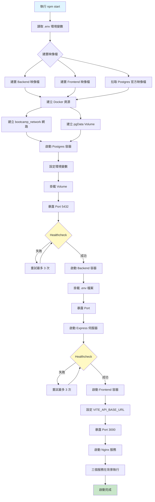
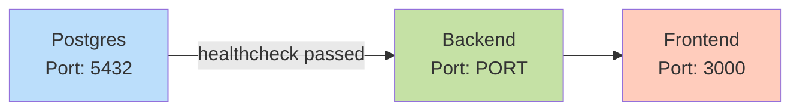
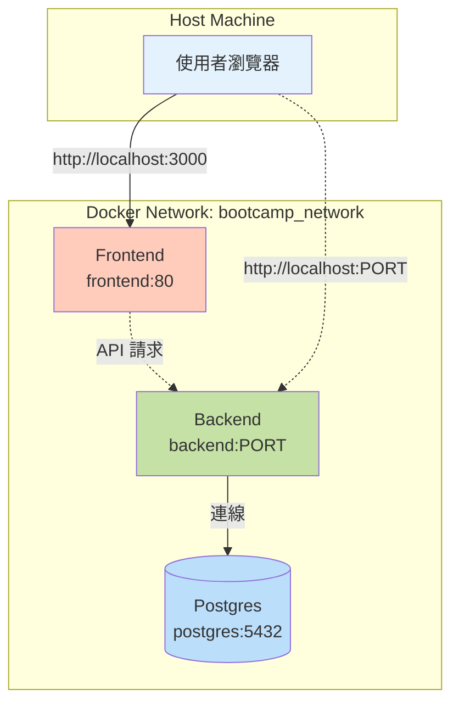

# npm start 執行流程說明

本文件說明在專案根目錄執行 `npm start` 後的完整流程。

## 執行指令

```bash
npm start
# 實際執行：docker compose --env-file .env up -d --build
```

## 流程圖



## 詳細步驟解析

### 1. 讀取環境變數 (`--env-file .env`)

載入專案根目錄的 `.env` 檔案，包含：
- 資料庫配置（DB_HOST, DB_PORT, DB_USERNAME, DB_PASSWORD, DB_DATABASE）
- 應用程式 Port（PORT）
- JWT 密鑰（JWT_SECRET）
- API Base URL（VITE_API_BASE_URL）

### 2. 建置映像檔 (`--build`)

| 服務 | 建置方式 | Dockerfile 位置 |
|------|---------|----------------|
| Backend | 自行建置 | `./backend/Dockerfile` |
| Frontend | 自行建置 | `./frontend/Dockerfile` |
| Postgres | 拉取官方映像檔 | `postgres:16.4-alpine3.20` |

### 3. 建立 Docker 資源

#### 網路
```yaml
bootcamp_network:
  # 讓三個服務可以互相通訊
```

#### Volume
```yaml
pgData:
  # 持久化 PostgreSQL 資料
```

### 4. 啟動服務順序

#### 階段一：Postgres (5432 port)

```yaml
postgres:
  - 設定資料庫使用者、密碼、資料庫名稱
  - 掛載 Volume 保存資料
  - 執行 healthcheck：pg_isready -U ${DB_USERNAME} -d ${DB_DATABASE}
  - 間隔 10 秒，超時 3 秒，最多重試 3 次
```

#### 階段二：Backend (${PORT})

```yaml
backend:
  depends_on:
    postgres:
      condition: service_healthy  # ⚠️ 必須等 Postgres 健康檢查通過
  - 掛載 .env 檔案為唯讀
  - 啟動 Express 應用程式
  - Healthcheck：wget --spider http://localhost:${PORT}/healthcheck
  - 間隔 30 秒，啟動後等待 20 秒，最多重試 3 次
```

#### 階段三：Frontend (3000 port)

```yaml
frontend:
  - 使用建置時的 VITE_API_BASE_URL 環境變數
  - 建置 Vue 3 應用程式
  - 透過 Nginx 提供靜態檔案服務
  - Port 對應：3000 (host) → 80 (container)
```

### 5. 背景執行 (`-d`)

所有容器以 detached mode 在背景執行，不佔用終端機。

## 服務相依關係圖



## 最終結果

執行完成後，會有三個運行中的容器：

| 服務 | 容器名稱前綴 | Host Port | Container Port | 用途 |
|------|------------|-----------|----------------|------|
| PostgreSQL | postgres | 5432 | 5432 | 資料庫服務 |
| Backend | backend | ${PORT} | ${PORT} | REST API 伺服器 |
| Frontend | frontend | 3000 | 80 | 網頁界面 (Nginx) |

## 檢查服務狀態

```bash
# 查看所有容器狀態
docker compose ps

# 查看即時日誌（所有服務）
docker compose logs -f

# 查看特定服務日誌
docker compose logs -f backend
docker compose logs -f frontend
docker compose logs -f postgres

# 檢查容器健康狀態
docker compose ps --format json | jq '.[].Health'
```

## 常見指令對比

| 指令 | 實際執行 | 行為 | 使用時機 |
|------|---------|------|----------|
| `npm start` | `docker compose up -d --build` | 啟動並建置所有服務 | 第一次啟動或程式碼更新後 |
| `npm run restart` | `docker compose up --force-recreate --build -d` | 強制重建並重啟所有容器 | 需要完全重建環境 |
| `npm run stop` | `docker compose stop` | 停止服務（保留資料和容器） | 暫時停止開發 |
| `npm run clean` | `docker compose down -v` | 停止並刪除容器、網路、Volume | 完全清除環境和資料 |

## 參數說明

### `docker compose up` 參數

| 參數 | 說明 |
|------|------|
| `--env-file .env` | 指定環境變數檔案位置 |
| `-d` | Detached mode，背景執行 |
| `--build` | 啟動前先建置映像檔 |
| `--force-recreate` | 強制重新建立容器（即使設定沒變） |

### Healthcheck 機制

**Postgres Healthcheck:**
```yaml
test: ["CMD-SHELL", "sh -c 'pg_isready -U ${DB_USERNAME} -d ${DB_DATABASE}'"]
interval: 10s
timeout: 3s
retries: 3
```

**Backend Healthcheck:**
```yaml
test: wget --no-verbose --tries=1 --spider http://localhost:${PORT}/healthcheck || exit 1
interval: 30s
timeout: 30s
retries: 3
start_period: 20s
```

## 日誌管理

所有服務都配置了日誌輪轉：

```yaml
logging:
  driver: "json-file"
  options:
    max-size: "10m"      # 單一日誌檔案最大 10MB
    max-file: 3          # 保留最多 3 個日誌檔案
    compress: "true"     # 壓縮舊日誌檔案
```

## 網路架構



## 故障排除

### Backend 無法啟動

1. 檢查 Postgres 是否健康：
   ```bash
   docker compose ps postgres
   ```

2. 查看 Backend 日誌：
   ```bash
   docker compose logs backend
   ```

3. 確認環境變數設定：
   ```bash
   docker compose exec backend env | grep DB_
   ```

### 資料庫連線失敗

1. 確認 `.env` 中的 `DB_HOST=postgres`（不是 localhost）
2. 檢查 Postgres healthcheck 狀態
3. 測試資料庫連線：
   ```bash
   docker compose exec postgres psql -U ${DB_USERNAME} -d ${DB_DATABASE}
   ```

### Port 衝突

如果遇到 Port 已被佔用：

```bash
# 檢查 Port 使用狀況
lsof -i :5432
lsof -i :3000
lsof -i :${PORT}

# 停止佔用 Port 的服務或修改 .env 中的 PORT 設定
```

## 參考資料

- [Docker Compose 文件](https://docs.docker.com/compose/)
- [專案架構說明](./CLAUDE.md)
- [Docker Compose 設定檔](./docker-compose.yml)
